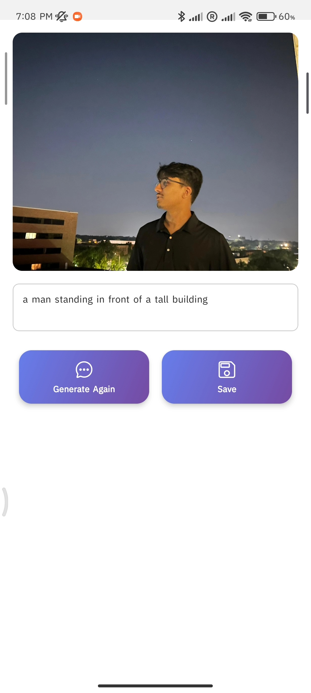

# Photophrase
A simple React Native app that lets you snap or pick a photo, generates an AI-powered caption using your own Flask-based captioning API, and saves your favorite image+caption pairs locally.

## Features

* Launch device camera or photo gallery
* Upload image to a local Flask API for AI-powered caption generation
* Display generated caption under the image
* Save images with captions to local storage (AsyncStorage)
* View and delete saved image+caption entries

## Prerequisites

* Node.js (v14+)
* Expo CLI (`npm install -g expo-cli`)
* Python 3.8+ for the Flask backend
* A local network (device and development machine on same Wi‑Fi)

## Getting Started

### 1. Clone the repo

```bash
git clone https://github.com/gaurav-subedi/photophrase.git
cd photophrase
```

### 2. Backend setup

1. Navigate to the backend folder:

   ```bash
   cd backend
   ```
2. Create and activate a virtual environment:

   ```bash
   python -m venv venv
   # Windows
   venv\Scripts\activate
   # macOS/Linux
   source venv/bin/activate
   ```
3. Install Python dependencies:

   ```bash
   pip install -r requirements.txt
   ```
4. Start the Flask server:

   ```bash
   python app.py
   ```
   This will run the flask server which contains the model. This API will receive an image from us and give the recommended caption.

### 3. Frontend (Expo) setup

1. Return to the root project folder:

   ```bash
   cd ..
   ```
2. Install Expo dependencies:

   ```bash
   npm install
   expo install @react-native-async-storage/async-storage
   ```
3. Update the API URL in `screens/PreviewScreen.tsx`:

   ```ts
   const API_URL = 'http://<YOUR_MACHINE_IP>:5000/caption';
   ```
   Type ipconfig in terminal cad copy paste the ipv4 link in the url.
4. Start the Expo server:

   ```bash
   expo start
   ```

## Usage

1. Launch the app in Expo Go on your device or simulator.
2. Pick or snap a photo.
3. Tap **Generate Caption** to get an AI-generated description.
4. (Optional) Edit the caption in the text box.
5. Tap **Save** to store the image+caption locally.
6. Navigate to **Saved** to view or delete stored items.
Demo

Embed your unlisted YouTube walkthrough directly in the README using a clickable thumbnail:

## Demo

[]((https://youtube.com/shorts/neYQvhaiuHE))

Clicking the thumbnail will open the video on YouTube.
